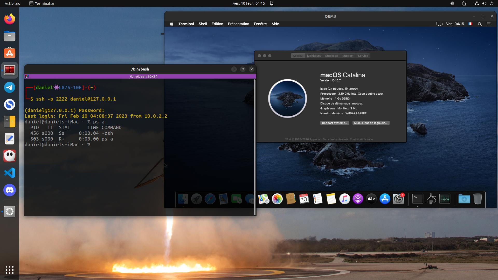

# Configuration personnelle de macOS-Simple-KVM
## Contexte
[macOS-Simple-KVM](https://github.com/foxlet/macOS-Simple-KVM) est un outil utilisant Qemu et KVM permettant d'émuler un système macOS sur PC, plusieurs version de macOS peuvent être installées; high-sierra, mojave et catalina.

Autres alternatives pour virtualiser macOS simplement :
|Outil|Description|
|---|---|
|[Sosumi](https://snapcraft.io/sosumi)|Application snap basée sur le projet macOS-Simple-KVM.|
|[Quickemu-project](https://github.com/quickemu-project/quickemu)|Outil utilisant Qemu et KVM permettant d'émuler plusieurs types de systèmes.|

Le rôle de ce script est d'automatiser l'installation de macOS sur un disque dur physique connecté par port USB ou SATA au travers d'une configuration virtuelle à l'aide du projet macOS-Simple-KVM.

Pour faire cette installation j’ai utilisé :
* Ubuntu 22.04
* QEMU emulator version 6.2.0
* Un disque dur physique connecté par port USB

## Fonctionnalités
1. Menu automatique permettant de récupérer le nom du disque dur à utiliser et la version de macOS à installer.
2. Configuration de l'audio.
3. Choix des paramètres automatisé.
4. Connexion internet.
5. Redirection du port 2222 vers le port 22 de la configuration virtuelle.

## Utilisation
```
./startmac.sh [-h|i]
    
Option 1: ./startmac.sh        Démarrage de la machine virtuelle.
Option 2: ./startmac.sh -i     Télécharge macOS-Simple-KVM et l'image d'installation de macOS, puis démarre la machine virtuelle.
Option 3: ./startmac.sh -h    Affiche l'aide.
```

1. Téléchargement du dépôt Ma_config_macOS-Simple-KVM
```bash
git clone https://github.com/DOSSANTOSDaniel/Ma_config_macOS-Simple-KVM.git
```

2. Démarrer une nouvelle installation
```bash
./startmac.sh -i 
```

3. Une fois l’image d’installation téléchargée et/ou le système installé sur le disque, alors on peut démarrer la machine virtuelle.
 ```bash
./startmac.sh
```

## Connexion SSH (Fonctionne seulement entre la machine hôte et l'invité)
 ```bash
ssh -p 2222 <USER>@127.0.0.1
```

## Installation de plusieurs versions de macOS
Création des différents répertoires et copie du script.
 ```bash
for macver in catalina high-sierra mojave; do mkdir -p $macver && cp startmac.sh ${macver}; done
```
On peut maintenant lancer le téléchargement des différentes images et leur installation dans chaque répertoire.

Voici un exemple :
```
Ma_config_macOS-Simple-KVM/
├── catalina
│   ├── installversion.log
│   ├── macOS-Simple-KVM
│   ├── README.md
│   └── startmac.sh
├── high-sierra
│   ├── installversion.log
│   ├── macOS-Simple-KVM
│   ├── README.md
│   └── startmac.sh
└── mojave
    ├── installversion.log
    ├── macOS-Simple-KVM
    ├── README.md
    └── startmac.sh
```



## Raccourcis
|Raccourci|Description|
|---|---|
|<kbd>Ctrl</kbd>+<kbd>Alt</kbd>+<kbd>g</kbd>|Libérer le curseur|
|<kbd>Ctrl</kbd>+<kbd>Alt</kbd>+<kbd>f</kbd>|Plein écran|
|<kbd>Ctrl</kbd>+<kbd>Alt</kbd>+<kbd>+</kbd>|Élargir l'écran|
|<kbd>Ctrl</kbd>+<kbd>Alt</kbd>+<kbd>-</kbd>|Réduire l'écran|
|<kbd>Ctrl</kbd>+<kbd>Alt</kbd>+<kbd>u</kbd>|Restaurer les dimensions de l'écran|

* Faire le symbole pipe sur mac : <kbd>Alt</kbd>+<kbd>Shift</kbd>+<kbd>l</kbd>

## Aides
* [Docummentation Qemu](https://qemu.readthedocs.io/en/latest/index.html)
* [MacOS-Simple-KVM](https://github.com/foxlet/macOS-Simple-KVM)
* [Manpages debian Qemu](https://manpages.debian.org/testing/qemu-system-x86/qemu-system-x86_64.1.en.html)
* [Archlinux Qemu](https://man.archlinux.org/man/qemu.1)
