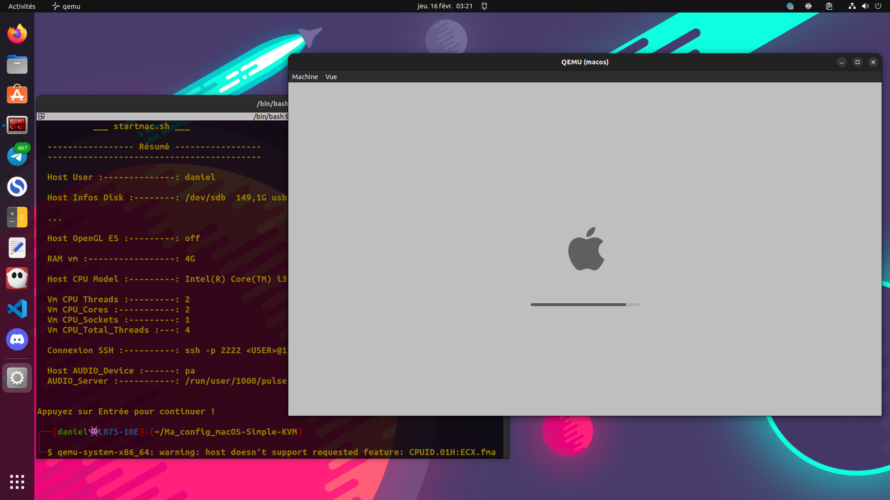

# Configuration personnelle macOS-Simple-KVM
[macOS-Simple-KVM](https://github.com/foxlet/macOS-Simple-KVM) est un outil utilisant Qemu et KVM permettant d'émuler un système macOS, sur un PC, plusieurs version de macOS peuvent être installées par défaut, dont high-sierra, mojave et catalina.

Pour information vous pouvez aussi installer l'application snap [Sosumi](https://snapcraft.io/sosumi) basé sur macOS-Simple-KVM.

## Contexte
On va installer macOS sur une machine virtuelle en utilisant un disque dur externe connecté par USB.
Pour faire cette installation j’ai utilisé :
* Ubuntu 22.04
* QEMU emulator version 6.2.0
* Un disque dur externe

### Autres fonctionnalités
1. Menu automatique permettant de faire le choix du disque dur à utiliser.
2. Configuration du son.
3. Choix des paramètres automatisé.
4. Configuration d'une connexion SSH.
5. Passthrough USB.

## Vérification si la virtualisation est supportée sur le système
```bash
[[ $(grep -Ec '(vmx|svm)' /proc/cpuinfo) -gt 0 ]] && echo "Virtualisation supportée!" || echo "Virtualisation non supportée!"
```

Si la virtualisation n'est pas supportée, voici quelques liens à suivre :
* [Activation,désactivation de la virtualisation matérielle, HP](https://support.hp.com/fr-fr/document/ish_5637148-5698278-16)
* [Activation,désactivation de la virtualisation matérielle, DELL](https://www.dell.com/support/kbdoc/fr-fr/000195978/activation-ou-desactivation-de-la-virtualisation-materielle-sur-les-systemes-dell)

## Installation des dépendances
```bash
sudo apt-get update && sudo apt-get install qemu-system qemu-utils python3 python3-pip bc git -y
```

## Téléchargement du dépôt macOS-Simple-KVM
```bash
git clone https://github.com/foxlet/macOS-Simple-KVM.git && cd macOS-Simple-KVM
```

## Téléchargement de l'image d'installation
Exemple avec la version catalina :
```bash
./jumpstart.sh --catalina
```

## Lancer l'installation de macOS
Copier le fichier basic.sh contenu dans le dossier Ma_config_macOS-Simple-KVM puis colle ce fichier dans le dossier macOS-Simple-KVM en écrasant l'ancien, puis lancer l'installation avec la commande :
```bash
./basic.sh
```
Par la suite pour lancer la machine virtuelle macOS on utilise la même commande.



## Aides
* [Docummentation Qemu](https://qemu.readthedocs.io/en/latest/index.html)
* [MacOS-Simple-KVM](https://github.com/foxlet/macOS-Simple-KVM)
* [Debian-facile Qemu](https://debian-facile.org/doc:systeme:vm:qemu)
* [Archlinux Qemu](https://man.archlinux.org/man/qemu.1)

## Améliorations
- [ ] Mise en place du PCIe Passthrough.
- [ ] Optimiser la configuration de la VM...